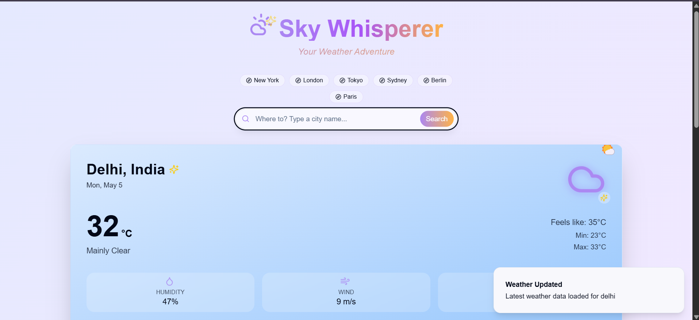

# Sky Whisperer - Weather Forecast Hub

## Project info

A magical weather application that provides current weather, forecast information, and fun facts about the weather in your area.

## Features

- Current weather conditions with beautiful UI
- 5-day weather forecast
- Weather details including humidity, wind speed, pressure, and visibility
- Fun weather facts and activity suggestions
- City search functionality
- Responsive design for all devices

This project is built with React, TypeScript, Vite, and Tailwind CSS.

## Technologies used

- Vite
- TypeScript
- React
- UI Component library
- Tailwind CSS
- Recharts
- React Router DOM

## Weather data

Weather data is provided by OpenMeteo API.

